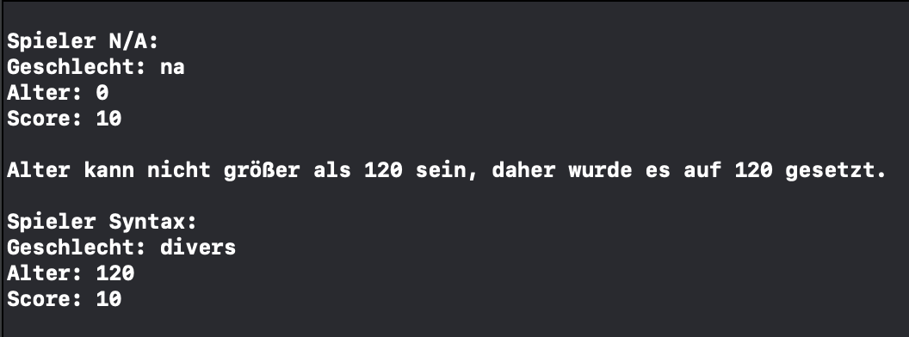

# Aufgabe_Swift_2.5 (Praxisfreitag)

Hinweis: Die folgenden Aufgaben sollen als Konsolen-Projekte erstellt werden

 

## 1. Spieler-Profil

**Erstelle ein structure Player, die einen Spieler des Ratespiels darstellt.**

Diese struct soll in der Datei `Player` erstellt werden.

Der Spieler soll mindestens folgende properties besitzen: 

- `name`
- `score`: Dieser soll auf den maximal-Score von 10 initiailisiert werden
- `gender`: nutze hierfür das bereits vorhandene enum `Gender`
- `age`: Setze für diese property getter und setter. Stelle sicher, dass als Alter nur Werte zwischen 0 und 120 erlaubt sind

Überlege dir gerne weitere sinnvolle properties.

Durch Auskommentieren des Beispiels in der main könnte deine Ausgabe wie folgt aussehen: 

 

## 2. Ratespiel

**Erstelle ein Ratespiel, bei dem du gegen den Computer antrittst**

Schreibe ein Konsolenprogramm, das ein Ratespiel implementiert. Der Computer wählt eine zufällige Zahl zwischen 1 und 100, 
und der Spieler muss erraten, welche Zahl es ist.
Das Programm sollte den Spieler bei jedem Versuch darüber informieren, ob die geratene Zahl zu hoch, zu niedrig oder genau richtig ist.

**In dem Projekt ist bereits folgendes  vorhanden:**

- Das struct `Player` aus Aufgabe 1
- Eine Klasse namens `Game`, die das Hauptspiel enthält und das Spiel starten soll. Diese hat als einziges Attribut `player` vom Typ `Player`. In dieser Klasse soll die Spiellogik geschrieben werden
- In der `main` soll das Spiel initialisiert werden.

**Außerdem zu beachten:**
- Der Spieler hat maximal 10 Versuche, die richtige Zahl zu erraten. 
- Das Programm sollte in einer Schleife laufen, bis der Spieler beschließt, das Spiel zu beenden
- Wenn der Spieler das Spiel beendet, soll ihm die Versuchsanzahl seines besten Durchlaufes angezeigt werden
- Zusatz: Berücksichtige, dass der Benutzer möglicherweise ungültige Eingaben macht. Benutze hierfür eine `guard let`- Abfrage

**Beispiel Output:**
 

 

## 3. Bonusaufgabe (Vererbung)

### 3.1 Person

- Erstelle eine Klasse namens `Person`. Sie soll folgende Eigenschaften haben: Einen Namen, ein Alter, den Wohnort und ein Energielevel
- Beim Energielevel soll berücksichtigt werden, dass es beim Initialisieren von der Person unter 1 ist und es darf nicht über 100 sein
- Außerdem soll die `Person` eine Methode `introduce` habe, womit sie sich vorstellt. In dieser Methode soll die `Person` alle ihre Eigenschaften in einem schön formulierten Satz ausgeben lassen.

### 3.2 Teilnehmer

- Erstelle eine Klasse namens `Teilnehmer`, welche von der Klasse `Person` erbt.
- Ein `Teilnehmer` soll eine Eigenschaft vom Typ `Modul` haben, welches wiederrum entweder `ux`, `grundlagen`, `kotlin` oder `swift` sein kann.
- Überschreibe die Methode `introduce`, so dass auch das Modul ausgegeben wird beim Vorstellen des Teilnehmers.

### 3.3 Dozent

- Erstelle eine Klasse namens `Dozent`, welche von der Klasse `Person` erbt.
- Ein `Dozent` soll eine Eigenschaft `teilnehmer` haben, welches eine Liste von Teilnehmern darstellen soll.
- Überschreibe die Methode `introduce`, so dass auch die Teilnehmer, welche zum Dozenten gehören ausgegeben werden.

### 3.4 Polymorphie

- Erstelle drei Teilnehmer, einer soll mit einem Energielevel von 150 initialisiert werden und einer zweiter Teilnehmer mit -1. Der dritte Teilnehmer mit einem Energielevel von 50. Lass deiner Kreativität bei den anderen Eigenschaften den freien Lauf.
- Erstelle einen Dozenten (Lasse auch hier deiner Kreativität den freien Lauf). Nutze die drei Teilnehmer vom vorherigen Punkt beim Erstellen des Dozenten.
- Erstelle nun eine Methode `introduceSomeone` in der `main`, welche sowohl einen Dozenten als auch einen Teilnehmer als Parameter akzeptiert. Die Methode soll von beiden die `introduce` Methode aufrufen. Rufe die Methode `introduceSomeone` in der main auf, überge einmal einen `Teilnehmer` und einmal den `Dozenten`. 

 

## Tipps und Hinweise
Achtung! Hier erhältst du Tipps und Hinweise zur Lösung. Versuche vorher die Aufgabe ohne Hinweise zu lösen.

Generell:

- Versuche deinen Code so gut wie möglich in eigene Dateien zu strukturieren.

Zu Aufgabe 2: 
- Arbeiten schrittweise: Implementiere das Spiel Schritt für Schritt, statt alles auf einmal zu versuchen. Beginne beispielsweise damit, eine Zufallszahl zu generieren und diese anzuzeigen, bevor du eine If-Anweisung oder Schleife hinzufügst.
- Ohne Schleifen kommst du hier nicht weit: Die while-Schleife ist dein Freund und Helfer.
- Lagere deine Spiellogik in unterschiedlichen Funktionen aus. Zum Beispiel kannst du eine Funktion `playAgain()` erstellen, die am Ende des Spiels den User fragt, ob er erneut spielen will. 
